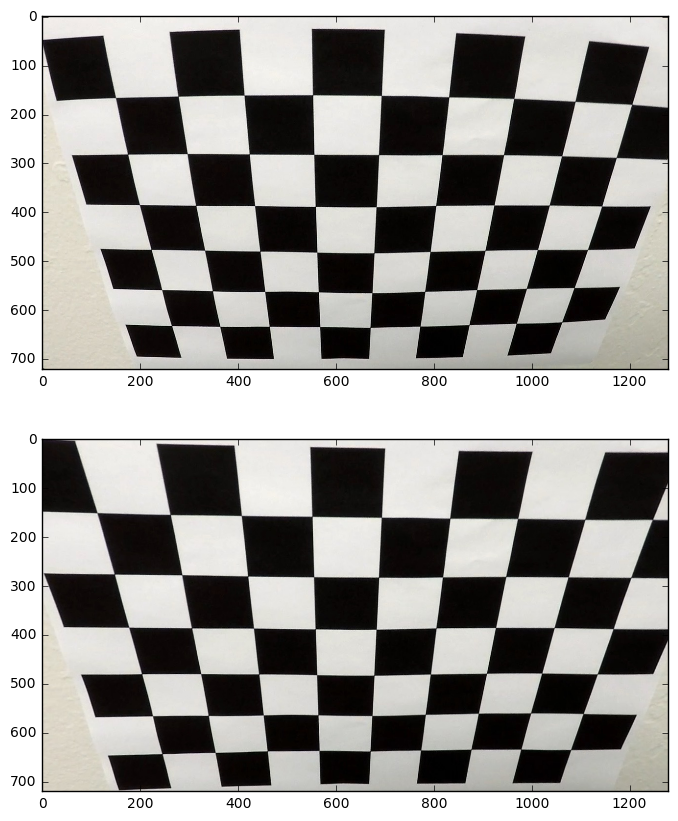
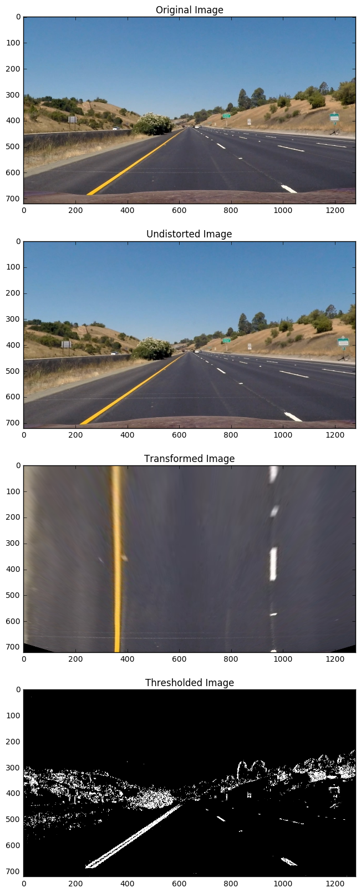
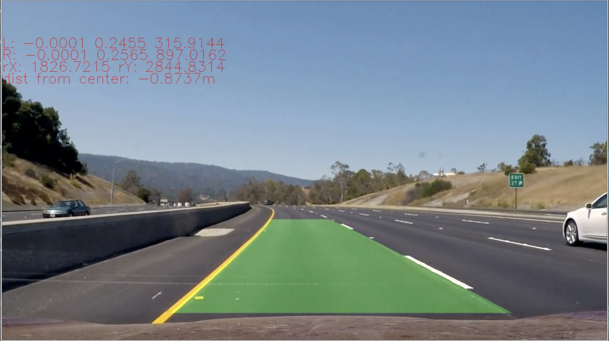

## Advanced Lane Finding Project - Johannes Kadak

The goals / steps of this project are the following:

* Compute the camera calibration matrix and distortion coefficients given a set of chessboard images.
* Apply a distortion correction to raw images.
* Use color transforms, gradients, etc., to create a thresholded binary image.
* Apply a perspective transform to rectify binary image ("birds-eye view").
* Detect lane pixels and fit to find the lane boundary.
* Determine the curvature of the lane and vehicle position with respect to center.
* Warp the detected lane boundaries back onto the original image.
* Output visual display of the lane boundaries and numerical estimation of lane curvature and vehicle position.

## [Rubric](https://review.udacity.com/#!/rubrics/571/view) Points

Here's another cookie-cutter writeup, hope it makes this easier to grade! There's a lot of interesting text under
the subsections, however.

I had a lot of fun with this project, especially since the CV pipeline was much more predictable and easier to tweak
than a neural net would be. Also, the testing cycle was much shorter due to its relatively fast runtime.

 [(on YouTube)](https://youtu.be/GXFEEGQ2CdI)
 [(on YouTube)](https://youtu.be/tMZxmRCgmOw)
 [(on YouTube)](https://youtu.be/IdgmndJVlDA)

---

### Camera Calibration

#### 1. Camera Matrix and Distortion Correction

The camera was inherently distorted, however the effects were barely noticeable except in the calibration images.

Calculating the camera matrix and distortion coefficients was done by using checkerboard images and OpenCV to measure 
distortion coefficients, generating a matrix and some vectors.

Essentially, what we do is generate a list of "object points" where every inner corner of the checkerboard is a 3D point with coordinates
(x, y, 0). This list will turn out to be (0, 0, 0), (0, 1, 0), ..., (1, 0, 0), (1, 1, 0), ..., (9, 6, 0). The checkerboard
images used a 9x6 inner corner checkerboard.

Every checkerboard point must correspond to a point on the image, therefore we can find the checkerboard corners and
generate a mapping between checkerboard and object points.

The code for calibration is contained in Prototype.ipynb under the heading **Camera Calibration**.

The function `cv2.calibrateCamera()` can figure out the mapping matrix and vectors, and we can save them after using
the calibration on all the images.

Afterwards, the matrix and vectors can be used with `cv2.undistort` to remove distortion on images for this camera.

Here's an example distorted and undistorted image:




### Pipeline (single images)

Here's what my pipeline looks like, with example images:



#### 1. Provide an example of a distortion-corrected image. 

This has been addressed in the above composited image.

#### 2. Describe how (and identify where in your code) you used color transforms, gradients or other methods to create a thresholded binary image.  Provide an example of a binary image result. 

The binary image has been addressed in the above composed image.

I used a simple pipeline of one saturation layer threshold, one lightness layer threshold and one x-axis Sobel kernel.

The method looks something like this:

- Undistort the image
- Convert the image into the HSL colorspace and separate the S and L layers
- Run a Sobel kernel on the S channel w.r.t the X axis, and threshold the result with accepted values between (12, 255).
- Take a threshold of the S channel with accepted values between (120, 255).
- Take a threshold of the L channel with accepted values between (40, 255).
- AND the three thresholds together.

The source code for this is in the function `thresh_pipeline()` in lanelinefinder.py lines 108-122.

#### 3. Describe how (and identify where in your code) you performed a perspective transform and provide an example of a transformed image.

The image was then perspective-transformed to align the lines vertically and create a sort of "birds-eye view" of the 
road. 

To do that, the function calls `cv2.warpPerspective` with pre-decided coordinates:

```
# Points on the original image
TRANSFORM_SRC = np.array([
    [577, 464],
    [707, 464],
    [289, 663],
    [1019, 663]
])

# ... must now correspond to these points on the destination image
TRANSFORM_DST = np.array([
    [361, 0],
    [963, 0],
    [361, 720],
    [963, 720]
])
```

I pre-instantiate the transforms in lanelinefinder.py lines 32-44, and use them in the function `transform_pipeline()`
lines 126-128.

In the pictures above ("Original Image" vs "Transformed Image"), it's visible that the lane lines have been stretched to
become parallel.


#### 4. Describe how (and identify where in your code) you identified lane-line pixels and fit their positions with a polynomial?

The lane-line-pixel identification was broken into two sections:

\1. Sliding Window search

Sliding Window search will use a method of finding the maximum amount of pixels in a window of a predetermined size. 
I split the frame vertically into 14 window-slides, move the window horizontally across the slice and find the max 
amount of pixels on each window. The centers of those maxed windows define our polynomial and we can fit a parabola 
to these points.

The code for this method is contained in lanelinefinder.py lines 283-382.

\2. Search using the previous frame's fit

Searching the previous frame will look for max pixels only in the close proximity to the previous window's center points.
In this project, I used a "proximity" value of 100 pixels.

When this method fails, I fall back to sliding window search.

The code for this method is contained in lanelinefinder.py lines 384-410.

---

[In this video](output_images/lane_fitting.mp4), the frames that show a wide green curve across the image use the 2nd method and the frames that show a 
bunch of rectangles surrounding the lanes use the 1st method. When the sliding window search is being used, it means 
that the previous frame's region did not result in useful lane line data.

#### 5. Describe how (and identify where in your code) you calculated the radius of curvature of the lane and the position of the vehicle with respect to center.

The curvature calculation simply maps one meter to a predefined amount of pixels and multiplies by this constant to
find the amount of meters, then finding the curvature as a radius of the circle this parabola will create.

The code for this method is contained in lanelinefinder.py lines 172-184.

#### 6. Provide an example image of your result plotted back down onto the road such that the lane area is identified clearly.

The lane lines are then plotted onto a rectangle and reverse-projected onto the lane line. The result of this is visible
in this image, containing among other things the left and right radii and the distance from the center of the lane.



---

### Pipeline (video)

#### 1. Provide a link to your final video output.  Your pipeline should perform reasonably well on the entire project video (wobbly lines are ok but no catastrophic failures that would cause the car to drive off the road!).

A video of the entire drive is available here: [video of the entire drive](output_images/lane_rendered.mp4). 

---

### Discussion

#### 1. Briefly discuss any problems / issues you faced in your implementation of this project.  Where will your pipeline likely fail?  What could you do to make it more robust?

I had the most problems getting my transformation right. I had taken the top coordinates of the transform too far back,
meaning the ends of the lanes were spreading outward and filtering through rather badly. This led to an unstable fit 
and issues trying to create a stable lane render.

Here's what my transform pipeline resulted in, before correction:

[Bad, but colorful transforms](progress/First Test - Bad Transforms.png)  
[Blurred Lines :P](progress/Second Test - Lines.png)

I also had issues wrapping my head around the techniques taught in the course, although in the end they both made a lot
more sense.

My pipeline will likely fail in these occasions:

1. Where the thresholding pipeline will detect pixels that aren't part of the actual lane lines, such as in the harder
challenge video, where there are highly saturated and bright pixels of the foliage and asphalt road.

2. Where the averaging and reduced-search-area method will likely be too sluggish to respond to the lane line changing.

3. Where a second-order polynomial doesn't comfortably define the curve that the lanes are taking. I saw that too in 
the harder challenge video, where the polynomial was bent and barely matched the end of the road. 

The sanity-checking method will likely mean the finder quickly recovers after a tougher patch of road, but this may
not be enough to cover all driving situations.

Thanks for reading my writeup!
